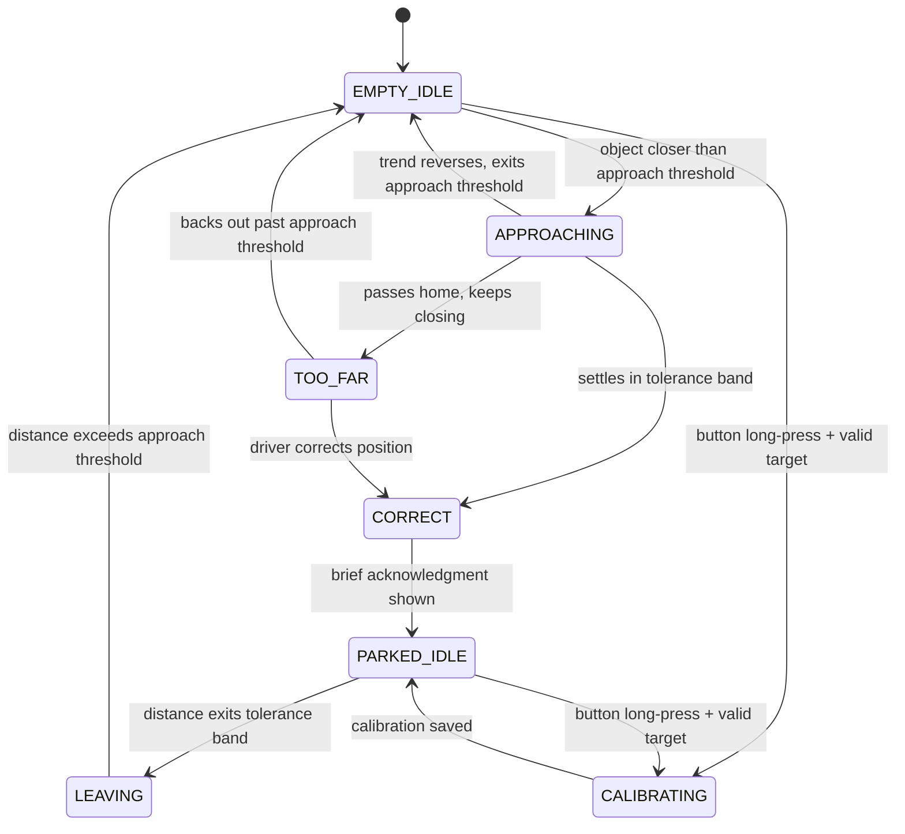

# Garage Parking Indicator — Design Doc

Status: prototype phase 1 parts ordered, awaiting arrival
Last updated: 2026-07-16

## Project brief

Original idea, verbatim from the project note:

> I'd like to use a TOF sensor and some LEDs and a button to create a parking indicator for the garage. You should be able to set the correct location of the car by holding the button while your car is in the right place – the TOF sensor should be used to note the distance. The device should use power sparingly when the car is in place or gone, and when the car approaches it should indicate that it sees the car approach, when it is in the right place, and when it has gone too far. I'm not sure if it should be powered by a wall wart or by battery, or perhaps rechargeable.
>
> This might be a fun MakerWorld crowdsource project, and simpler than the ISS pointer bot.

Future direction, not built yet: the eventual display is a series of LEDs that converge as the car approaches the right spot, until the whole unit goes solid green. That's the target user experience. Everything below is groundwork for it.

## Decisions log

1. **Microcontroller**: Adafruit QT Py ESP32-C3 (product 5405) was the first pick — small, STEMMA QT connector, deep sleep around 43 µA. It's currently out of stock at Adafruit.
2. Considered QT Py RP2040 (in stock, $9.95, no WiFi/BLE, no true low-microamp deep sleep) as a replacement.
3. **Settled on QT Py S3 with 2MB PSRAM (product 5700, $12.50, in stock)** instead. Reason: Adafruit's own listing documents its GPIO0 button as usable "for entering the ROM bootloader or for user input" — a real, code-readable button after boot. The RP2040's boot-select button is wired into the flash bootloader circuit and isn't reliably readable at runtime. Since we need a calibration button and want to avoid extra hardware for phase 1, the S3's documented dual-use button wins. Deep sleep is about 70 µA — close enough to the C3 for now.
4. **TOF sensor**: Adafruit VL53L1X STEMMA QT breakout (product 3967). Range 30 mm to 4,000 mm over I2C. Connects to the QT Py with a single STEMMA QT cable — no soldering.
5. **LEDs / display**: deferred. Phase 1 uses only the QT Py's onboard NeoPixel as a stand-in for state feedback. The converging-LED-array display is a separate design task, to be scoped once state logic is proven and once we know how the final unit needs to mount and read from a driver's seat.
6. **Button hardware**: deferred, same reasoning as above — using the QT Py S3's onboard GPIO0 button for calibration during bring-up.
7. **Power source** (wall wart vs. battery vs. rechargeable): not yet decided. Deferred until we've measured real current draw from the state machine below. See "Power strategy" for the two paths under consideration.

## Phase 1 bill of materials

- Adafruit QT Py S3 with 2MB PSRAM (5700)
- Adafruit VL53L1X Time of Flight sensor, STEMMA QT breakout (3967)
- STEMMA QT / Qwiic cable, 50mm (4399)
- USB-C cable, for programming and bench power

No breadboard, no external LEDs, no external button. This is the smallest possible rig to prove the state logic.

**Ordered 2026-07-16**: VL53L1X STEMMA QT breakout, 100mm STEMMA QT cable, QT Py S3 with 2MB PSRAM. Once the sensor board is in hand, check whether GPIO1/XSHUT header pins come pre-soldered — resolves the open question under "Power strategy" below.

## State behavior

### States

| State | What's happening | Power posture |
|---|---|---|
| `EMPTY_IDLE` | No car in the bay. | MCU in light sleep, sensor polled on a slow timer. |
| `PARKED_IDLE` | Car is in the bay, in the correct spot. | MCU in light sleep, sensor polled on a slow timer. |
| `APPROACHING` | Something has entered the near zone and distance is decreasing toward home. | MCU awake, sensor polled fast, live feedback. |
| `CORRECT` | Distance has settled inside the tolerance band around home. | MCU awake briefly to confirm and acknowledge, then drops to `PARKED_IDLE`. |
| `TOO_FAR` | Distance has passed home and kept closing — car has overshot. | MCU awake, sensor polled fast, alert feedback, stays awake until resolved. |
| `LEAVING` | Distance is opening up from a parked or too-far position. | MCU awake just long enough to confirm the trend, no indication shown, then drops to `EMPTY_IDLE` once clear. |
| `CALIBRATING` | Button long-press while a valid target is in range. | MCU awake, brief. |

### State diagram

Kept as Mermaid rather than draw.io on purpose: it's text, so it lives in this file and changes with the design instead of drifting out of sync in a separate binary. Most markdown viewers (GitHub, VS Code, many note apps) render it inline. If you want a polished version for a presentation later, draw.io is the better tool for that specific job — but for a working doc that changes weekly, text-as-diagram wins.

### Transitions

Starting from `EMPTY_IDLE`: the sensor watches for anything closer than the approach threshold. When it sees one, wake into `APPROACHING`.

From `APPROACHING`: if distance keeps decreasing and settles within the tolerance band around home for the debounce period, move to `CORRECT`, acknowledge, then `PARKED_IDLE`. If distance decreases past the far edge of the tolerance band, move to `TOO_FAR` and stay awake — a driver mid-overshoot needs live feedback, not a device that's gone back to sleep. If instead the distance trend reverses and grows back past the approach threshold — someone pulled up, changed their mind, and backed out — drop straight back to `EMPTY_IDLE` with no indication. That's the "ignore a car that's leaving" case: it never reached `CORRECT` or `TOO_FAR`, so there's nothing to walk back.

From `PARKED_IDLE`: the sensor watches for distance leaving the tolerance band. When it does, wake into `LEAVING`. Show nothing — a departing car doesn't need approach or overshoot feedback, those only make sense for an arrival. Stay in `LEAVING`, unlit, until distance exceeds the approach threshold, then drop to `EMPTY_IDLE`.

From `TOO_FAR`: if the driver corrects and distance moves back into the tolerance band, go to `CORRECT`. If they give up and back out past the approach threshold, go to `EMPTY_IDLE`, same as any other departure.

The key trick, and the reason this doesn't need velocity sensing or anything fancy: the meaning of a distance reading depends entirely on which idle state we woke from. Waking from `EMPTY_IDLE` means someone's arriving, so we run the approach/correct/too-far logic. Waking from `PARKED_IDLE` means someone's leaving, so we suppress all of that and just wait for the bay to clear. Same sensor, same readings, different interpretation based on context.

### Distance parameters (starting points, to be tuned on the bench)

- **Home distance** (`D_home`): set by calibration.
- **Tolerance band**: ± 75 mm around `D_home`. This is the `CORRECT` zone.
- **Approach threshold**: `D_home` + 1.5 m. Anything closer than this, when the bay was empty, counts as an arrival in progress. This needs tuning against actual garage depth — a shallow bay may need a smaller margin.
- **Settle debounce**: distance must stay inside the tolerance band for 1.5 seconds before declaring `CORRECT`. Avoids flicker from a car still creeping or from sensor noise at the boundary.
- **Departure debounce**: distance must stay outside the approach threshold for 1 second before declaring `EMPTY_IDLE`. Avoids a false "gone" from a single bad reading.
- **Calibration hold time**: 2 seconds.

None of these are validated yet — they're reasonable starting guesses, not measurements. First bench session should log real distance traces for a car pulling in, parking, and pulling out, so these numbers can be set from data instead of intuition.

### Calibration

Button long-press while the car is parked where you want it. On release after the hold threshold, read the current distance, validate it's a real in-range reading (30 mm–4,000 mm, not a "no target" result), store it as `D_home` in non-volatile memory so it survives power loss, and acknowledge with the NeoPixel — a short green flash sequence for now, standing in for whatever the final acknowledgment looks like on the real display. If the reading is invalid (no target in range), skip the save and flash a different color to signal the calibration didn't take.

### Power strategy — open question

Two ways to keep this low-power, and they trade off differently:

**Option A — sensor-driven interrupt wake.** The VL53L1X can run fully autonomously: it takes its own readings on a timer (as slow as 1 Hz), compares against a programmed threshold window, and only pulls its interrupt pin (GPIO1) low when the target crosses that threshold. The host MCU can be in deep sleep the entire time and only wake on that interrupt. ST's own numbers put this around 65 µA at 1 Hz. Combined with the QT Py S3's own ~70 µA deep sleep, total idle draw would land somewhere near 150 µA — good battery life. The catch: GPIO1 (and XSHUT, for controlling sensor power) aren't part of the STEMMA QT connector, which only carries I2C and power. Using this mode needs a wire from the sensor board's GPIO1 pin to a QT Py GPIO pin — meaning either the breakout ships with header pins pre-installed (needs checking on the product page before ordering) or it needs soldering. That conflicts with the no-solder goal for a future kit.

**Option B — timer-driven polling, I2C only.** Skip the interrupt pin entirely. The MCU wakes itself on an internal timer (once a second while idle), takes a single distance reading over I2C — the same STEMMA QT cable already in use — decides what state that implies, and goes back to sleep. Simpler, works with the plug-and-play cable alone, no extra wiring ever.

Correction to the first draft of this doc: this needs CircuitPython's **light sleep**, not deep sleep. Deep sleep shuts down the CPU and RAM entirely — `code.py` restarts from the top on every wake, which means the running state machine would need to be reconstructed from scratch every single second. Light sleep pauses execution and resumes exactly where it left off, so the in-memory state (which state we're in, current readings) survives naturally. It costs more than deep sleep — light sleep on the S3 draws roughly 2–4 mA versus deep sleep's ~70 µA — but at a once-a-second wake cadence, deep sleep's reboot overhead would dominate anyway. Deep sleep only starts to make sense if Option A's multi-second-or-longer, interrupt-driven wake pattern is adopted later. `D_home` is still written to non-volatile memory regardless, since that needs to survive a full power cycle, not just a sleep cycle.

Recommendation: **build phase 1 on Option B.** It matches the "STEMMA QT cable only, no soldering" constraint that a kit will need anyway, and it's simpler to get right first. If bench testing shows the battery life isn't good enough, revisit Option A as a deliberate power upgrade, and decide then whether the extra wire is worth it or whether a different sensor breakout with GPIO1 broken out to a second STEMMA QT connector exists.

## Open questions

- Real garage bay depth and sensor mount position — needed to set the approach threshold sensibly, and to pick the VL53L1X distance mode (short/medium/long) and timing budget that covers the actual range needed without wasting power on unnecessary accuracy.
- Whether the VL53L1X STEMMA QT breakout ships with GPIO1/XSHUT header pins pre-soldered, in case Option A becomes necessary later.
- What happens if the bay sees a false target — a person walking through, a bicycle leaned against the wall — while idle. Current design treats it like any other approach: wakes, runs the state machine, times out back to `EMPTY_IDLE` when the object doesn't settle in the tolerance band. Costs a wake cycle, not correctness. Worth confirming that's an acceptable trade rather than adding object-classification logic.
- Power source decision (wall wart / battery / rechargeable) is blocked on real current measurements from the state machine above.

## Bring-up notes (confirmed against Adafruit's QT Py S3 pinout guide)

- **macOS + UF2 drag-and-drop**: Finder can fail with "the device disappeared" when dragging a `.uf2` file onto `QTPYS3BOOT`. Sometimes this is a benign Finder/extended-attributes race (check if `CIRCUITPY` appeared anyway; if not, `cp -X path/to/firmware.uf2 /Volumes/QTPYS3BOOT/` from Terminal is the fix). **But if the write drops consistently, even direct-connected and even via `cp -X`, the real cause on this board is something else entirely — see next point.**
- **4MB board + CircuitPython 10.x bootloader mismatch**: our board is the 4MB Flash / 2MB PSRAM variant. CircuitPython 10.0.0 and later use a new single 2.8MB firmware partition layout on 4MB Espressif boards; the factory-shipped bootloader still expects the old two-partition layout. Loading a CircuitPython 10.x `.uf2` onto the old bootloader causes the write to fail partway through (macOS reports `fcopyfile failed: Input/output error` and/or "the device disappeared") — this looks identical to a cable/hub/Finder problem but isn't one. Fix: update the bootloader first via the OPEN INSTALLER button on the board's page at circuitpython.org (Chrome or Firefox only, not Safari — needs WebSerial). This erases the board and installs bootloader 0.33.0+ with the new partition layout. After that, double-tap reset, confirm `INFO_UF2.TXT` on `QTPYS3BOOT` shows 0.33.0 or later, then load CircuitPython normally.

- `board.STEMMA_I2C()` and `board.NEOPIXEL` are correct as used in `code.py` — confirmed against the official pinout page.
- Important gotcha: the STEMMA QT connector is a **second, separate I2C bus** (`SCL1`/`SDA1`), not the same as the `board.SCL`/`board.SDA` header pins. `board.STEMMA_I2C()` addresses the right one. Don't wire anything to the SCL/SDA header pads expecting it to talk to the STEMMA QT sensor — it won't.
- The GPIO0 "boot" button is confirmed reusable as a plain input-with-pullup after boot. What's **not** confirmed yet is the exact `board.*` constant CircuitPython uses for it on this board — could be `board.BUTTON`, `board.BOOT0`, or something else. Check once CircuitPython is installed: open the REPL and run `import board; print(dir(board))`, find the button's real name in the list, and fix the `button = digitalio.DigitalInOut(board.BUTTON)` line in `code.py` if it's not actually `BUTTON`.

## Next steps

1. `bench_test.py` in this same folder is a minimal hardware smoke test — just confirms the VL53L1X answers over the STEMMA QT bus and prints a distance reading once a second, no state machine. Run this first.
2. `code.py` is the first-draft state machine. **Not yet run on real hardware.** Once `bench_test.py` confirms the sensor is talking, install `adafruit_vl53l1x` and `neopixel` to CIRCUITPY/lib (`circup install adafruit_vl53l1x neopixel` is the easy path), confirm the button pin name per above, then load `code.py`.
3. Bench-test with an actual car (or a stand-in object on a cart) to validate the distance parameters and debounce timings in the doc above — they're starting guesses, not measurements.
4. Measure real current draw in each state to inform the power source decision.
5. Scope the converging-LED-array display as its own design task.
